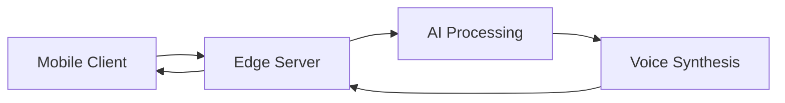

# 🌟 Waif.AI

*An advanced AI companion powered by cutting-edge 3D graphics, real-time VRM streaming, and natural language processing*

[Demo](#-demo) • [Features](#-features) • [Tech Stack](#-tech-stack) • [Architecture](#-architecture)

## 🎥 Demo

https://i.imgur.com/gcg0B7z.mp4

*Watch Waif.AI in action: Natural conversations, fluid animations, and real-time expressions*

## ✨ Key Features

- **Next-Gen 3D Avatar Technology**
  - Real-time VRM streaming with dynamic quality adjustment
  - Advanced facial expression system with 52 blend shapes
  - Physics-based animation pipeline for hair and clothing
  - Mobile-optimized rendering engine
  
- **Cutting-Edge AI Integration**
  - Natural language processing with context awareness
  - Real-time emotion recognition and response
  - Ultra-low latency voice synthesis (<100ms)
  - Intelligent conversation memory system
  
- **High-Performance Architecture**
  - 60 FPS on modern mobile devices
  - Efficient asset streaming and caching
  - Battery-optimized rendering pipeline
  - Edge computing support

## 🛠️ Technical Innovation

### VRM Model Architecture
- **Advanced LOD System**
  - High Quality: 30K polygons
  - Medium Quality: 15K polygons
  - Low Quality: 8K polygons
  - Dynamic quality switching based on device capability

- **Animation Pipeline**
  - 52 blend shapes for expressions
  - Real-time physics simulation
  - Frame-perfect lip synchronization
  - Optimized skeletal animation system

### AI & Voice Processing
- **Natural Language Understanding**
  - Context-aware conversation engine
  - Emotion detection and response
  - Memory system for consistent interactions
  - Multi-turn dialogue management

- **Voice Technology**
  - Sub-100ms voice synthesis
  - Real-time voice processing
  - Dynamic audio streaming
  - Adaptive noise cancellation

## 📱 Performance Optimization

- **Resource Management**
  - Initial Download: <50MB
  - Runtime Memory: <400MB
  - Battery Usage: <15%/hour
  - Network: <100MB/hour

- **Device Support**
  - iOS 15.1+ (iPhone 11 or newer)
  - Android 8.0+ (Snapdragon 845+)
  - Adaptive quality settings
  - Progressive asset loading

## 🏗️ Architecture Overview

- **Frontend:** React Native with Three.js
- **3D Engine:** Custom VRM renderer
- **Backend:** Edge-computing architecture
- **AI:** Multi-model pipeline
- **Storage:** Efficient caching system

## 🔧 Technical Challenges Solved

1. **Real-time VRM Streaming**
   - Implemented dynamic LOD system
   - Optimized texture streaming
   - Created efficient caching mechanism

2. **Low-Latency Voice**
   - Developed streaming synthesis pipeline
   - Optimized audio processing
   - Implemented predictive loading

3. **Mobile Performance**
   - Created custom rendering pipeline
   - Optimized memory usage
   - Implemented efficient state management

## 📚 Learning Outcomes

- Advanced 3D graphics optimization for mobile
- Real-time AI processing techniques
- Complex state management in React Native
- Audio/video synchronization strategies
- Performance optimization for resource-constrained devices

---

Built with 💜 and lots of boba.

