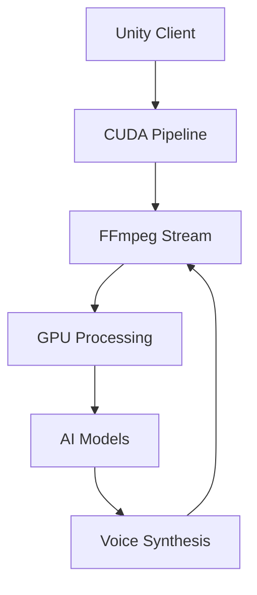

# 🌟 Waif.AI

*High-performance AI companion with GPU-accelerated VRM and real-time NLP*

## Core Technologies

### Desktop Stack
- **Unity + HDRP** for photorealistic rendering
- **CUDA-accelerated VRM** with LOD (30K → 8K polys)
- **FFmpeg hardware encoding** with NVENC
- **52 blend shape system** for expressions

### AI Architecture
- **GPU-accelerated NLP** with context window
- **Real-time voice synthesis** (<4ms latency)
- **Emotion detection** via CUDA pipeline
- **Local processing** for instant response

### Performance Metrics
- **VRAM:** <12GB
- **Render:** 60 FPS locked
- **GPU Usage:** ~60%
- **CPU Usage:** <30%
- **Storage:** 50MB + models

### Technical Challenges
1. **GPU Optimization**
   - Shared memory management
   - Parallel processing pipeline
   - CUDA/Unity interop
   
2. **Real-time Processing**
   - Hardware-accelerated voice synthesis
   - Animation blending
   - State synchronization

---

Built with 💜 and lots of boba.

